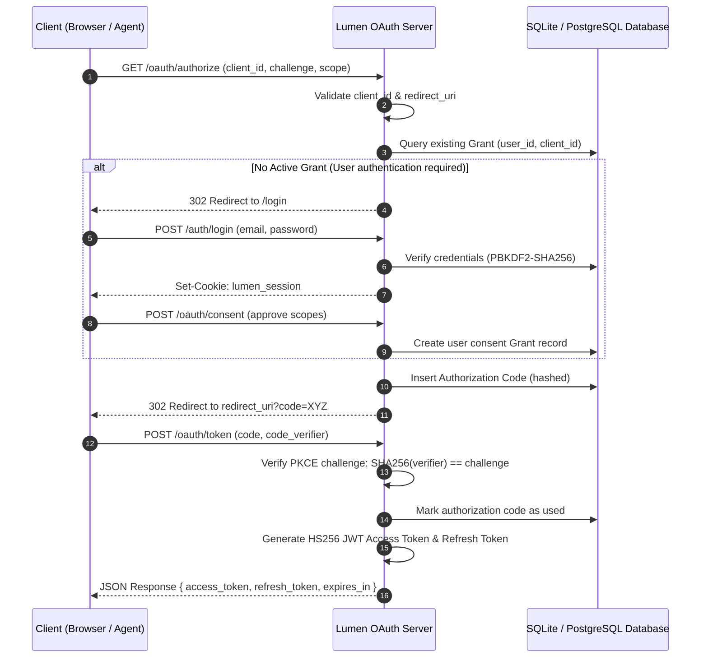

<!--
#
# Licensed to the Apache Software Foundation (ASF) under one or more
# contributor license agreements.  See the NOTICE file distributed with
# this work for additional information regarding copyright ownership.
# The ASF licenses this file to You under the Apache License, Version 2.0
# (the "License"); you may not use this file except in compliance with
# the License.  You may obtain a copy of the License at
#
#     http://www.apache.org/licenses/LICENSE-2.0
#
# Unless required by applicable law or agreed to in writing, software
# distributed under the License is distributed on an "AS IS" BASIS,
# WITHOUT WARRANTIES OR CONDITIONS OF ANY KIND, either express or implied.
# See the License for the specific language governing permissions and
# limitations under the License.
#
-->

# Lumen OAuth

[](go.mod)
[](../LICENSE)

Lumen OAuth is a production-grade, zero-dependency OAuth 2.0 / OpenID Connect (OIDC) identity and authorization server written entirely in Go (based strictly on the `net/http` standard library).

Designed to integrate seamlessly into cloud-native environments (such as the **[Lumen Ecosystem](../README.md)**), Lumen OAuth provides secure, microservice-level federated identity and access management.

---

## 1. Project Overview & Core Security Standards

### 1.1 Architectural Positions
- **Zero Web Framework Overhead**: Leverages standard library HTTP routing and middlewares, achieving minimum footprint, fast startups, and absolute safety.
- **Enterprise-Grade Identity Protections**: Implements complete authorization schemes with PKCE and Refresh Token Rotation to prevent session hijacking and replay attacks.
- **RFC 7591 Dynamic Client Registration (DCR)**: Automates OAuth client onboarding processes, essential for AI agents or external MCP clients.

### 1.2 Core Security Features
- **Timing Attack Mitigation**: Employs `subtle.ConstantTimeCompare` across all password comparisons, signature checks, CSRF validations, and token hashes.
- **Advanced RTR & Replay Detection**: Implements token lineage tracing. If any reused refresh token is presented, the entire associated Grant is atomically revoked, mitigating token theft instantly.
- **NIST-Compliant Passwords**: Utilizes PBKDF2-SHA256 password hashing running **210,000 iterations**, ensuring high entropy and safety against brute-force attacks.

---

## 2. Architecture

### OAuth 2.0 Authorization Code + PKCE Flow



---

## 3. Technology Stack

- **HTTP Framework**: Standard `net/http` Library (Zero framework dependencies)
- **Database**: PostgreSQL (pgx v5) + SQLite (for local dev)
- **JWT Signing**: Custom HS256 to ensure complete safety and omit third-party flaws
- **Password Hashing**: PBKDF2-SHA256 (210k iterations)
- **Configuration**: Standard YAML

---

## 4. Key Security Decisions

| Decision | Justification |
|------|------|
| **HS256 vs RS256** | Simplified deployment for single-issuer intra-cluster operations. |
| **Mandatory PKCE S256** | Prevents Authorization Code Interception Attacks. "Plain" is not supported to prevent downgrade attacks. |
| **Hashed Secrets Storage** | `client_secret`, `auth_code`, and `refresh_token` are all hashed. |
| **Constant Time Comparisons** | Usage of `subtle.ConstantTimeCompare` everywhere to prevent timing-based side-channel leaks. |
| **Refresh Token Rotation** | Replaced tokens track chains; replaying invalidates the entire chain immediately. |

---

## 5. Deployment & Quick Start

Included natively in the Lumen Ecosystem's Docker Compose setup.

```bash
# Health Check
curl http://localhost:9080/healthz

# OIDC Discovery
curl http://localhost:9080/.well-known/openid-configuration
```

---

## 6. License

Licensed under the Apache License, Version 2.0. See the [LICENSE](../LICENSE) file for details.
