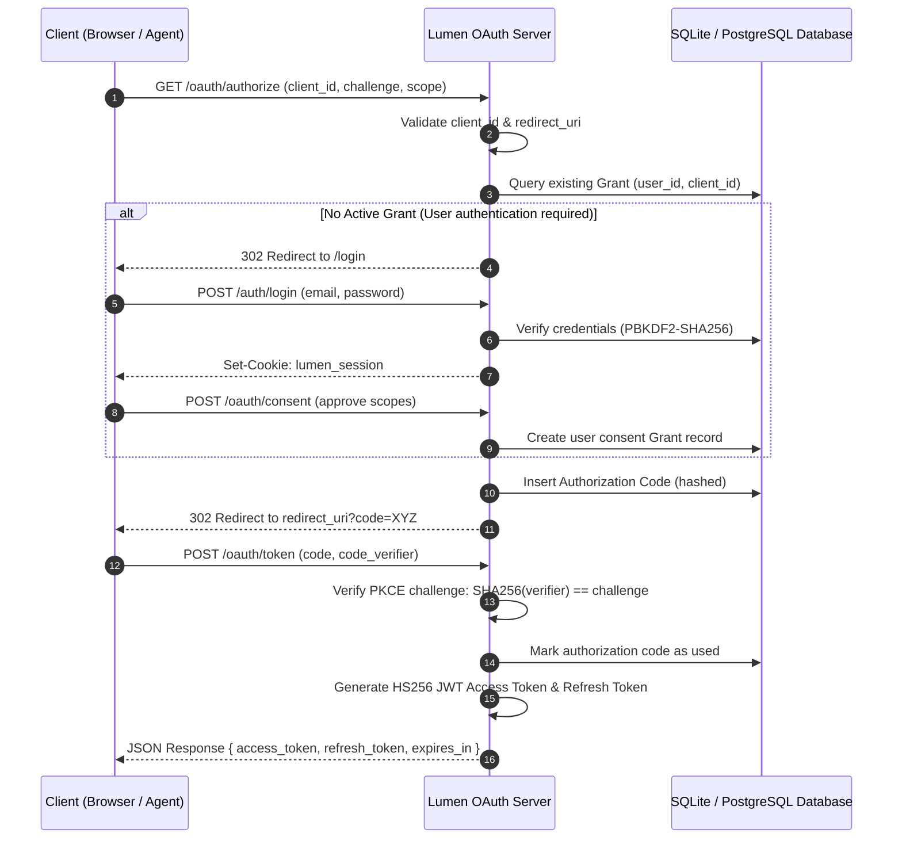
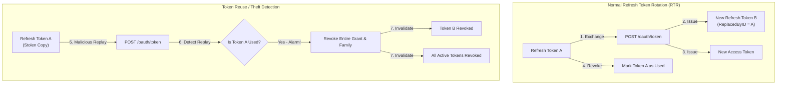
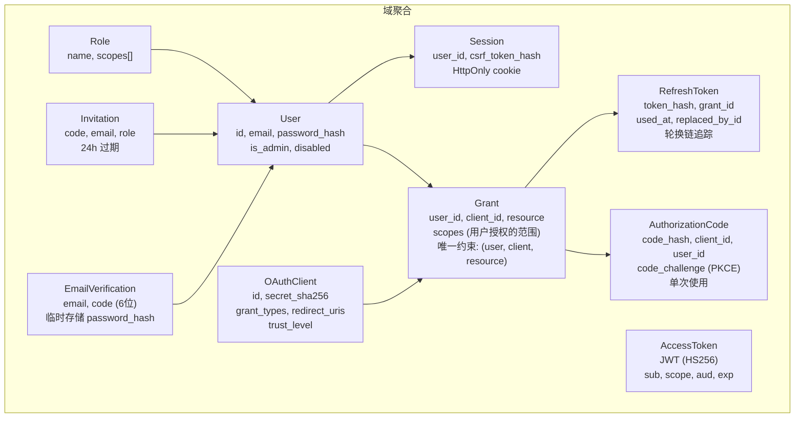
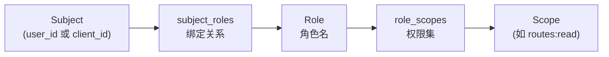

<!--
#
# Licensed to the Apache Software Foundation (ASF) under one or more
# contributor license agreements.  See the NOTICE file distributed with
# this work for additional information regarding copyright ownership.
# The ASF licenses this file to You under the Apache License, Version 2.0
# (the "License"); you may not use this file except in compliance with
# the License.  You may obtain a copy of the License at
#
#     http://www.apache.org/licenses/LICENSE-2.0
#
# Unless required by applicable law or agreed to in writing, software
# distributed under the License is distributed on an "AS IS" BASIS,
# WITHOUT WARRANTIES OR CONDITIONS OF ANY KIND, either express or implied.
# See the License for the specific language governing permissions and
# limitations under the License.
#
-->

# Lumen OAuth

[](go.mod)
[](../LICENSE)

Lumen OAuth is a production-grade, zero-dependency OAuth 2.0 / OpenID Connect (OIDC) identity and authorization server written entirely in Go (based strictly on the `net/http` standard library).

Designed to integrate seamlessly into cloud-native environments (such as the **[Lumen Ecosystem](../README.md)**), Lumen OAuth provides secure, microservice-level federated identity and access management.

---

## 1. Project Overview & Core Security Standards

### 1.1 Architectural Positions
- **Zero Web Framework Overhead**: Leverages standard library HTTP routing and middlewares, achieving minimum footprint, fast startups, and absolute safety.
- **Enterprise-Grade Identity Protections**: Implements complete authorization schemes with PKCE and Refresh Token Rotation to prevent session hijacking and replay attacks.
- **RFC 7591 Dynamic Client Registration (DCR)**: Automates OAuth client onboarding processes, essential for AI agents or external MCP clients.

### 1.2 Core Security Features
- **Timing Attack Mitigation**: Employs `subtle.ConstantTimeCompare` across all password comparisons, signature checks, CSRF validations, and token hashes.
- **Advanced RTR & Replay Detection**: Implements token lineage tracing. If any reused refresh token is presented, the entire associated Grant is atomically revoked, mitigating token theft instantly.
- **NIST-Compliant Passwords**: Utilizes PBKDF2-SHA256 password hashing running **210,000 iterations**, ensuring high entropy and safety against brute-force attacks.

---

## 2. 项目背景与目标 (Project Targets)

### 2.1 项目定位 (Positioning)

Lumen OAuth 是一个纯 Go 实现的 OAuth 2.0 / OpenID Connect 授权服务器，不依赖任何 Web 框架（基于 `net/http` 标准库）。支持授权码 + PKCE、动态客户端注册 (DCR)、刷新令牌轮换与重用检测、RBAC、邮箱验证注册和邀请制入驻，为 Lumen 平台提供统一身份认证。

### 2.2 核心目标 (Core Goals)

| 目标 | 描述 |
|------|------|
| **OAuth 2.0 完整实现** | Authorization Code + PKCE (S256)、Client Credentials、Refresh Token Rotation |
| **OIDC 兼容** | Discovery、JWKS、标准 Claims |
| **动态客户端注册** | RFC 7591 DCR，支持 open / guarded / iat_required / disabled 四种模式 |
| **安全优先** | PBKDF2-SHA256 (210k 迭代)、常量时间比较、CSRF 保护、重用检测 |
| **六边形架构** | domain → application → infrastructure → interfaces 严格分层 |

### 2.3 对标项目 (Comparisons)

| 项目 | 语言 | 对比 |
|------|------|------|
| [ory/hydra](https://github.com/ory/hydra) | Go | Lumen OAuth 更轻量，与网关深度集成，内置用户注册 |
| [Keycloak](https://github.com/keycloak/keycloak) | Java | Lumen OAuth 单二进制部署，无 JVM 依赖 |
| [Authelia](https://github.com/authelia/authelia) | Go | Lumen OAuth 原生 OAuth 2.0 + DCR，非代理认证模式 |
| [Dex](https://github.com/dexidp/dex) | Go | Lumen OAuth 支持用户注册和 RBAC，不仅是联合身份 |

**核心差异化**：与 Lumen Gateway + MCP Server 深度集成，提供网关级别的 per-tool scope 授权能力，支持 AI Agent 的 OAuth 授权流程。

---

## 3. 整体架构 (Architecture)

### 3.1 OAuth 授权码 + PKCE 流程



### 3.2 刷新令牌轮换与重用检测



### 3.3 设计原则

| 原则 | 实现方式 |
|------|----------|
| **安全优先** | 所有密钥 SHA256 哈希存储，常量时间比较，PKCE S256 强制 |
| **六边形架构** | 端口/适配器模式，所有依赖通过接口注入 |
| **域模型驱动** | 10 个域聚合，纯领域逻辑无外部依赖 |
| **审计可追溯** | 所有认证事件记录到 audit_log 表 |

---

## 4. 技术选型 (Tech Stack)

### 4.1 核心依赖

| 组件 | 选型 | 理由 |
|------|------|------|
| **HTTP 框架** | net/http 标准库 | 零依赖，完全控制中间件栈 |
| **数据库** | PostgreSQL (pgx v5) + SQLite | 生产用 PG，开发用 SQLite，同一接口 |
| **JWT 签名** | 手写 HS256 | 避免引入 jwt-go 等第三方库，完全掌控安全细节 |
| **密码哈希** | PBKDF2-SHA256 | NIST 推荐，210k 迭代，~100ms/次 |
| **YAML 配置** | gopkg.in/yaml.v3 | Go 标准 YAML 解析 |

### 4.2 未选方案

| 方案 | 未选理由 |
|------|----------|
| RS256 签名 | 单发行方场景 HS256 更简单，对称密钥分发在容器化环境更方便 |
| bcrypt / Argon2 | PBKDF2 足够安全且跨平台一致性更好 |
| gin / echo | 标准库已满足需求，减少依赖面 |
| GORM | 直接 SQL 更透明，避免 ORM 抽象泄漏 |

---

## 5. 核心模块设计 (Module Designs)

### 5.1 域模型



### 5.2 安全机制

#### 密码哈希
```
算法: PBKDF2-SHA256
迭代: 210,000 次 (NIST 推荐)
盐长: 16 字节 (crypto/rand)
密钥长: 32 字节
格式: pbkdf2-sha256$210000$BASE64(salt)$BASE64(key)
比较: subtle.ConstantTimeCompare (常量时间)
```

#### JWT 签名
```
算法: HS256 (HMAC-SHA256)
Claims: iss, sub, aud, client_id, scope, jti, iat, exp
默认 TTL: access_token 15分钟, refresh_token 30天
签名验证: 常量时间比较
```

#### PKCE (S256)
```go
// 仅支持 S256，不支持 plain（防止降级攻击）
challenge = BASE64URL(SHA256(verifier))
// 验证时使用常量时间比较
subtle.ConstantTimeCompare(computed, challenge)
```

#### CSRF 保护
- 登录时生成 CSRF token，SHA256 哈希存储在 Session 中
- Consent POST 请求必须携带 `X-CSRF-Token` 头
- Cookie: `HttpOnly`, `SameSite=Lax`, HTTPS 时自动 `Secure`

#### 客户端密钥存储
- 仅存储 SHA256 哈希，明文仅在 DCR 注册时返回一次
- 验证时使用常量时间比较

### 5.3 令牌生命周期

| 令牌类型 | TTL | 存储方式 | 安全特性 |
|----------|-----|----------|----------|
| Access Token | 15 分钟 | JWT (无状态) | HS256 签名 |
| Authorization Code | 5 分钟 | DB (code_hash) | 单次使用，PKCE 绑定 |
| Refresh Token | 30 天 | DB (token_hash) | 轮换 + 重用检测 → 撤销 Grant |
| Session | 12 小时 | DB + Cookie | HttpOnly, CSRF 保护 |
| Verification Code | 10 分钟 | DB | 6 位数字，最多 5 个待验证 |

### 5.4 动态客户端注册 (DCR)

**RFC 7591 实现**：

| 模式 | 描述 |
|------|------|
| `open` | 无需授权即可注册 |
| `guarded` | 需要 Initial Access Token (IAT) |
| `iat_required` | IAT 强制要求 |
| `disabled` | 禁用 DCR |

**注册流程**：
1. 验证 IAT（如模式要求）
2. 校验 grant_types、response_types
3. 验证 redirect_uris（loopback / custom scheme / hosted HTTPS）
4. 生成 client_id、client_secret（SHA256 哈希存储）
5. 设置 TrustLevel: `unknown_dcr`（默认）/ `trusted` / `blocked`
6. 返回 client_id + client_secret（明文仅此一次）

**Redirect URI 校验规则**：
- Loopback: `http://localhost:*/callback`（可配置路径白名单）
- Custom Scheme: `cursor://anysphere.cursor-mcp/oauth/callback`
- Hosted HTTPS: `https://claude.ai/api/mcp/auth_callback`
- 禁止 fragment、禁止通配符

### 5.5 RBAC



**Scope 解析流程**：
1. 查询 subject 绑定的所有 role
2. 展开 role → scopes
3. 与请求 of scopes 取交集 = 授权范围

### 5.6 用户注册与邮箱验证

**注册流程**：
1. `POST /auth/register`: 校验邮箱格式、密码 ≥ 8 字符
2. 检查邮箱未注册，限流（每邮箱最多 5 个待验证码）
3. 生成验证码：开发模式固定 `111111`，生产模式 6 位随机
4. SMTP 发送验证邮件（10 分钟有效），临时保存密码哈希
5. `POST /auth/verify-email`: 验证码正确 → 创建用户

### 5.7 Bootstrap Admin

```yaml
bootstrap_admin:
  enabled: true
  email: admin@example.com
  password: admin
  force_change_password: true
```

首次启动时自动创建管理员用户（幂等），密码 PBKDF2 哈希存储。

---

## 6. API 端点 (Endpoints)

### 6.1 OAuth / OIDC

| 方法 | 路径 | 功能 |
|------|------|------|
| GET | `/.well-known/openid-configuration` | OIDC Discovery |
| GET | `/.well-known/oauth-authorization-server` | OAuth AS Metadata |
| GET | `/.well-known/jwks.json` | 公钥集 (JWKS) |
| GET | `/oauth/authorize` | 授权端点（PKCE 必需） |
| POST | `/oauth/token` | 令牌端点（auth_code / refresh / client_credentials） |
| POST | `/oauth/register` | 动态客户端注册 (DCR) |
| POST | `/oauth/consent` | 用户授权同意（CSRF 保护） |
| GET | `/oauth/consent/request` | 获取同意页数据 |

### 6.2 认证 (Auth)

| 方法 | 路径 | 功能 |
|------|------|------|
| POST | `/auth/login` | 邮箱密码登录，返回 access_token + session |
| POST | `/auth/logout` | 撤销 session |
| GET | `/auth/me` | 当前用户信息 |
| POST | `/auth/register` | 用户自助注册 |
| POST | `/auth/verify-email` | 邮箱验证 |
| POST | `/auth/invitations` | 创建邀请（管理员） |
| POST | `/auth/register/accept` | 接受邀请注册 |

### 6.3 管理 (Admin)

| 方法 | 路径 | 功能 |
|------|------|------|
| GET | `/admin/roles` | 角色列表 |
| POST | `/admin/roles` | 创建/更新角色 |
| POST | `/admin/roles/delete` | 删除角色 |
| POST | `/admin/role-bindings` | 绑定角色 |
| POST | `/admin/role-bindings/unbind` | 解绑角色 |

### 6.4 页面 (HTML)

| 路径 | 功能 |
|------|------|
| `/login` | 浏览器登录页（OAuth 流程） |
| `/consent` | 浏览器授权同意页 |

---

## 7. HTTP 中间件 (Middlewares)

| 顺序 | 中间件 | 功能 |
|------|--------|------|
| 1 | SecurityHeaders | CSP, X-Frame-Options: DENY, X-Content-Type-Options: nosniff |
| 2 | CORS | 可配置来源，支持 credentials，暴露 X-Request-Id |
| 3 | RequestID | 16 字符 hex ID，传播 X-Request-Id |
| 4 | Recovery | panic 恢复，记录堆栈，返回 500 |
| 5 | AccessLog | JSON/TEXT 结构化请求日志，包含 method、route、status_class、duration_ms、bytes、request_id |
| 6 | Metrics | expvar HTTP 总量、错误、延迟与低基数 route 维度指标 |

### 7.1 可观测性端点

| 配置 | 默认值 | 行为 |
|------|--------|------|
| `observability.metrics_enabled` | `true` | 开启 expvar 指标 |
| `observability.metrics_path` | `/metrics` | 指标端点；开启后同时保留 `/debug/vars` 兼容端点 |
| `observability.pprof_enabled` | `false` | 显式开启 pprof 诊断端点 |
| `observability.pprof_path` | `/debug/pprof` | pprof base path |

expvar 指标包含：
- `oauth_http_requests_total`
- `oauth_http_errors_total`
- `oauth_http_latency_ms_total`
- `oauth_http_routes`：按 `method`、ServeMux `route` pattern、`status_class` 聚合，未知路径统一记录为 `unmatched`，避免高基数标签。

---

## 8. 存储层 (Storage)

### 8.1 数据表

| 表名 | 主要字段 |
|------|----------|
| `users` | id, email (unique), password_hash, is_admin, disabled |
| `oauth_clients` | id, secret_sha256, grant_types, redirect_uris, trust_level |
| `oauth_authorization_codes` | code_hash (unique), client_id, user_id, code_challenge, used_at |
| `oauth_grants` | user_id, client_id, resource (唯一约束), scopes, revoked_at |
| `oauth_refresh_tokens` | token_hash (unique), grant_id, used_at, replaced_by_id |
| `auth_sessions` | user_id, csrf_token_hash, expires_at, revoked_at |
| `subject_roles` | subject, role_name (复合主键) |
| `role_scopes` | role_name, scope (复合主键) |
| `invitations` | code (PK), email, role_name, expires_at, used_at |
| `email_verifications` | email, code, password_hash, expires_at, verified_at |
| `oauth_audit_log` | action, actor, client_id, result, trace_id, details_json |

### 8.2 双驱动支持
- **PostgreSQL** (pgx v5): 生产环境，`ON CONFLICT` 语法
- **SQLite** (modernc.org/sqlite): 开发环境，`INSERT OR IGNORE` 语法
- 同一 Repository 接口，启动时自动建表 + 迁移

---

## 9. 构建与部署 (Build & Deploy)

### 9.1 单独运行

```bash
# 依赖 PostgreSQL 或 SQLite
go run ./cmd/lumen-oauth --config configs/config.yaml
```

### 9.2 全栈部署（Docker Compose 一键启动）

Lumen OAuth 是 Lumen 全栈平台的一部分。使用根目录的 `docker-compose.yml` 可一键启动所有服务：

```bash
docker compose up -d --build
```

启动后验证 OAuth 服务：

```bash
# 健康检查
curl http://localhost:9080/healthz
# {"status":"ok"}

# OIDC 发现
curl http://localhost:9080/.well-known/openid-configuration

# 默认管理员登录
curl -X POST http://localhost:9080/auth/login \
  -H 'Content-Type: application/json' \
  -d '{"email":"admin@example.com","password":"admin"}'
```

---

## 10. 代码结构 (Code Structure)

```
cmd/lumen-oauth/              入口
internal/
├── domain/                   纯域模型（无外部依赖）
│   ├── user/                 用户聚合
│   ├── client/               OAuth 客户端
│   ├── authcode/             授权码
│   ├── grant/                授权授予
│   ├── refreshtoken/         刷新令牌
│   ├── session/              登录会话
│   ├── verification/         邮箱验证
│   ├── token/                访问令牌值对象
│   ├── invite/               邀请
│   └── role/                 RBAC 角色
├── application/              用例层
│   ├── auth/                 登录、授权、令牌交换、同意
│   ├── dcr/                  动态客户端注册
│   ├── registration/         用户自助注册 + 验证
│   ├── invite/               邀请管理
│   ├── rbac/                 角色管理
│   ├── audit/                审计事件
│   └── ports/                端口接口定义
├── infrastructure/           适配器
│   ├── jwt/                  HS256 JWT 签名 + 验证
│   ├── jwks/                 JWKS Provider
│   ├── password/             PBKDF2-SHA256 哈希器
│   ├── redirect/             Redirect URI 校验器
│   ├── sqlite/               PostgreSQL + SQLite 仓库
│   ├── email/                SMTP + 控制台邮件发送
│   ├── clock/                系统时钟（可测试）
│   └── idgen/                随机 ID 生成器
├── interfaces/http/          HTTP 层
│   ├── handlers/             请求处理器
│   ├── middleware/            CORS, RequestID, Recovery, Metrics
│   └── routes/               路由组合
├── platform/                 日志、可观测性
└── bootstrap/                应用装配
```

---

## 11. 关键安全决策 (Security Decisions)

| 决策 | 理由 |
|------|------|
| **HS256 而非 RS256** | 单发行方，对称密钥在容器化环境分发更简单 |
| **PKCE S256 强制** | 防止授权码拦截攻击，不支持 plain 防止降级 |
| **哈希存储所有密钥** | client_secret SHA256、auth_code SHA256、refresh_token SHA256 |
| **210k PBKDF2 迭代** | 满足 NIST SP 800-132 建议，~100ms/次平衡安全与性能 |
| **常量时间比较** | 所有密码/令牌/CSRF 比较使用 `subtle.ConstantTimeCompare` |
| **刷新令牌轮换** | 旧令牌标记已使用，新令牌携带 ReplacedByID 链 |
| **重用检测** | 已使用令牌被重放 → 撤销整个 Grant → 所有令牌失效 |
| **SameSite=Lax Cookie** | 防 CSRF 同时允许跨站导航 |
| **Grant 级 Scope** | 用户按 (client, resource) 维度授权，支持增量同意 |

---

## 12. 未来规划 (Roadmap)

- **RS256 签名**：支持非对称密钥，简化跨服务验证
- **Token Introspection**：RFC 7662 实现，支持不透明令牌
- **密钥轮换**：多签名密钥 + 平滑过渡
- **WebAuthn / Passkeys**：无密码登录
- **联合身份 (SAML/OIDC)**：作为 RP 对接企业 IdP
- **令牌撤销端点**：RFC 7009 实现
- **审计日志增强**：独立审计服务 + 事件溯源

---

## 13. License

Licensed under the Apache License, Version 2.0. See the [LICENSE](../LICENSE) file for details.
